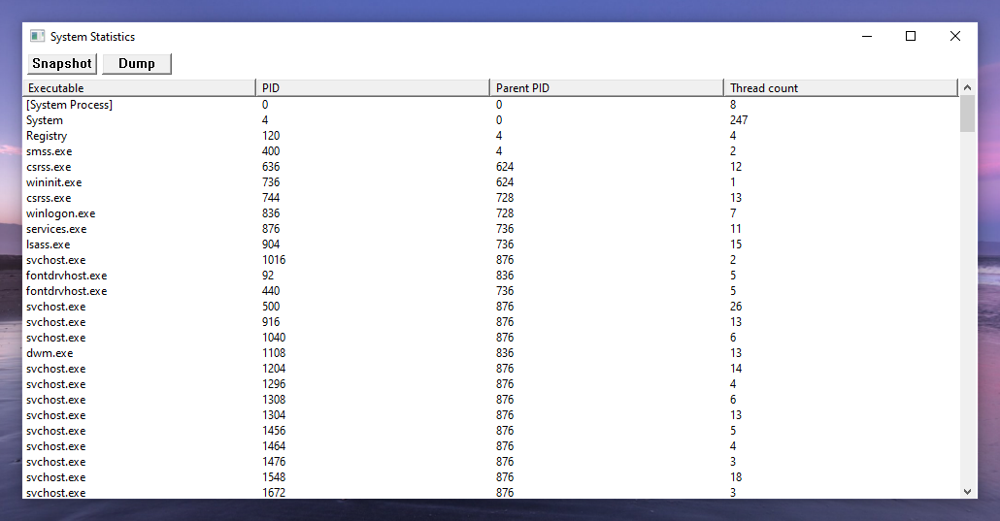
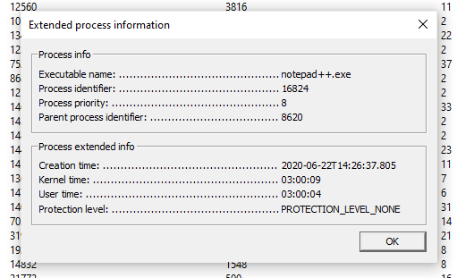
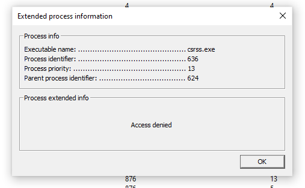
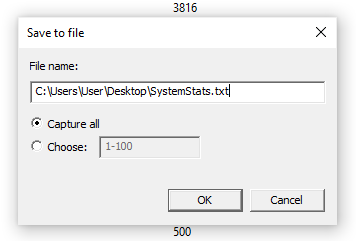
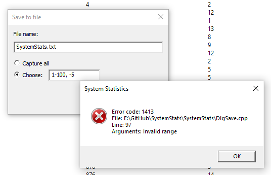

# SystemStats

Simple processes viewer implemented in C++ with Win32 API, MFC classes and ATL. It uses also Tool Help Library to easily enumerate processes.

## Main features

- All running processes are displayed



- Double-click on each process shows an extended information about this process, but it can be unavailable due to access denial

 

- Information about processes can be saved into a text file



This file looks like this:

```
System Statistics app.
(c)2020 Georgy Firsov

Process entry (#1 in dump). Executable: [System Process], PID = 0, process priority = 0, parent PID = 0, number of threads = 8
Process entry (#2 in dump). Executable: System, PID = 4, process priority = 8, parent PID = 0, number of threads = 247
Process entry (#3 in dump). Executable: Registry, PID = 120, process priority = 8, parent PID = 4, number of threads = 4
Process entry (#4 in dump). Executable: smss.exe, PID = 400, process priority = 11, parent PID = 4, number of threads = 2
Process entry (#5 in dump). Executable: csrss.exe, PID = 636, process priority = 13, parent PID = 624, number of threads = 12
Process entry (#6 in dump). Executable: wininit.exe, PID = 736, process priority = 13, parent PID = 624, number of threads = 1
...
```

- You can manually choose, which processes to save, and application will check your input


